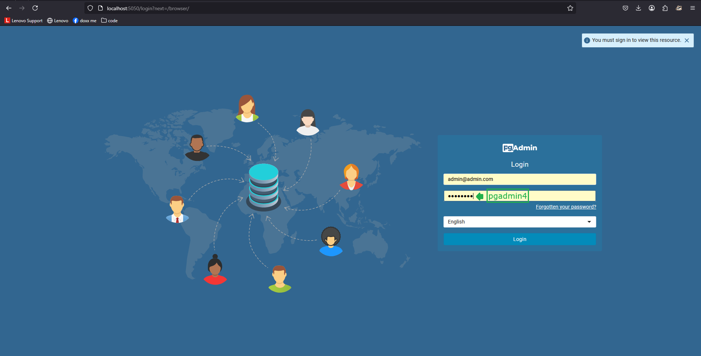
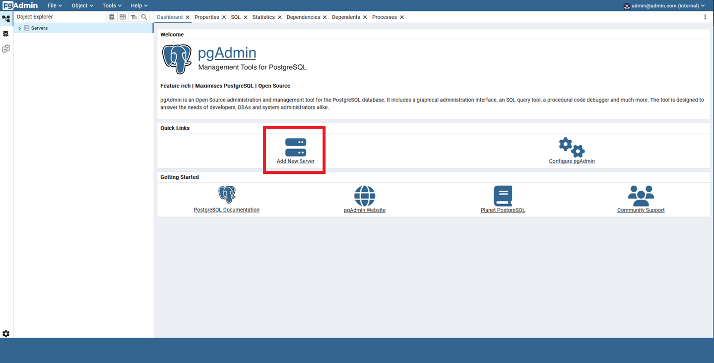
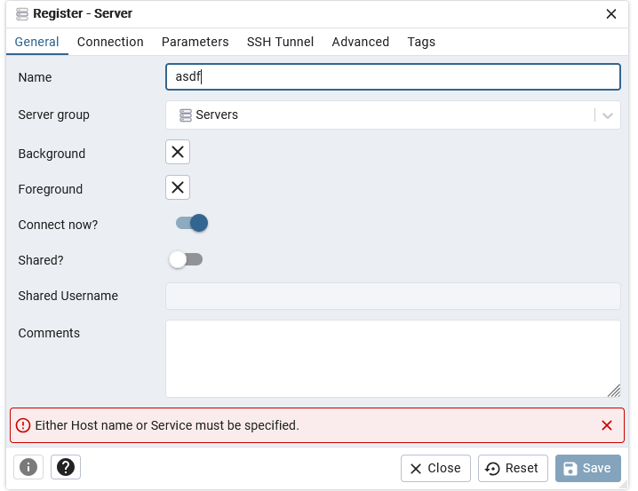
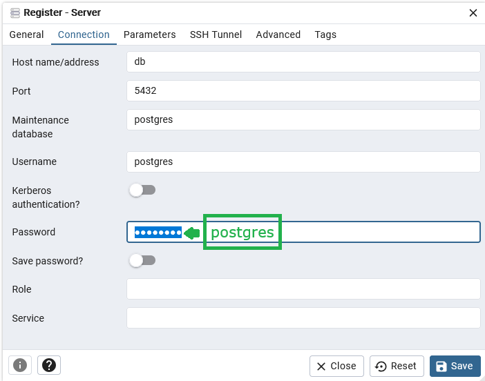
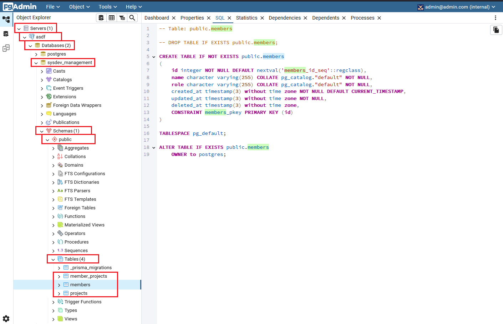
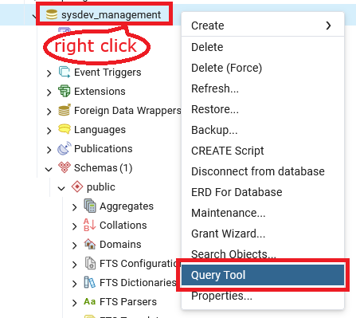

# Molero-Stage-1

Stage 1 of the SAMAHAN SysDev technical assessment.

# About the project:

- To be run in WSL 2 on Windows, or simply used in a Linux machine
- Backend JS framework: Nest.js
- Database: PostgreSQL (with pgAdmin)
- Orchestrated with Docker
- Works on my machine

I don't know how to set up MySQL as of the moment.

# How to run:

If you're on Windows, you must use WSL and start up Docker Desktop,
otherwise it will complain that "Docker" can't be found on this machine.

- WSL: https://learn.microsoft.com/en-us/windows/wsl/install
- Docker desktop: https://docs.docker.com/desktop/setup/install/windows-install/

Simply run this command to enter the WSL terminal,

```bat
wsl
```

Then run the following lines (preferably one by one) to clone the repository and run the server.

```sh
git clone https://github.com/raffimolero/Molero-Stage-1.git
cd Molero-Stage-1.git
npx prisma generate
# of course, you should check ./run.sh before running this script.
chmod +x ./run.sh
./run.sh
```

After the docker engine runs, you should be able to access the api through http://localhost:3000/

pgAdmin is also available through http://localhost:5050/

- I followed this tutorial so refer to it when using pgAdmin https://dev.to/chukwutosin_/step-by-step-guide-setting-up-a-nestjs-application-with-docker-and-postgresql-5hei
- Should look something like this when setting up:
  - 
  - 
  - server name can be anything, not necessarily `asdf`
  - 
  - 
  - 
  - 
  - 

# Other Notes:

- nestjs is in localhost:3000/
- pgadmin is in localhost:5050/
  - username is admin@admin.com
  - password is pgadmin4
- postgresql is in localhost:5432/

# How it was made:

- nest new api
- push to github
- remove .env from .gitignore for demo purposes
- pull out docker-compose, Dockerefile, run.sh, .dockerignore, and .gitattributes from inventory
- install extra modules that don't come by default somehow

```sh
npm i --save @nestjs/mapped-types @nestjs/common @nestjs/core
```

- install prisma by attempting to invoke it

```sh
npx prisma init
```

- modify DATABASE_URL in .env to have the correct username password and hostname

  - username: postgres
  - password: postgres
  - hostname: db (defined in docker-compose.yml)
  - database: sysdev_management (as instructed)

- encode the schema for members, projects, and member_projects in prisma/schema.prisma
- start up the database

```sh
# terminal 1
./run.sh
```

- using a separate terminal, run the migration
  - i'm aware that docker allows you to spawn the containers and reuse the same terminal for other things. i just decided to have an interactive bash session for convenience and because i can type `exit` instead of `docker compose down -v`

```sh
# terminal 2
npx prisma migrate dev --name init
```

- open pgAdmin and sign in
- connect to the postgres server
- right click sysdev_management and open query tool
- insert some members
